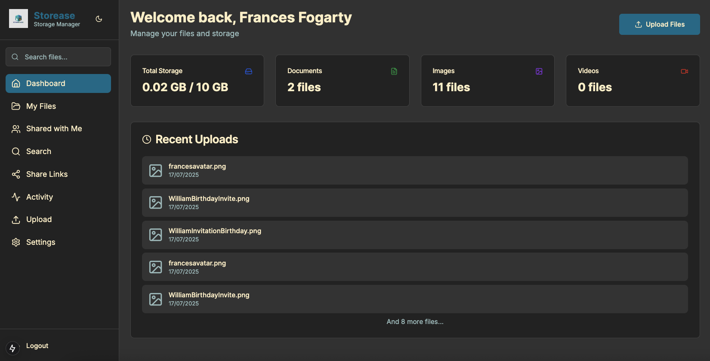

# 🗄️ Storease - Storage Management Solution

A modern, full-stack file storage and management platform built with Next.js 15 and Appwrite. This application provides users with secure file upload, management, and sharing capabilities through a clean, professional interface with dark/light mode support.

## ✨ Features

### 🔐 Authentication & Authorization

- **Email/password authentication** with secure session management
- **Role-based access control** (Guest, User, Admin)
- **Protected routes** with middleware-based authentication
- **Permission-based UI** rendering with PermissionGate components
- **Automatic session validation** and user context management

### 📁 File Management

- **Multiple file type support**: Documents, images, videos, audio files
- **Drag & drop upload** with visual feedback and progress tracking
- **Batch file operations** with selection management
- **File metadata storage** (name, size, type, URL, upload date)
- **Advanced file operations**:
  - Individual and bulk file deletion
  - File renaming and updating
  - File sharing with customizable permissions
  - Download functionality with progress tracking

### 🔗 File Sharing

- **Public share links** with customizable expiration
- **User-to-user sharing** with permission levels
- **Share management dashboard** to track active shares
- **Copy-to-clipboard** share links
- **Revoke access** capability

### 📊 Storage Analytics & Activity

- **Real-time storage usage** tracking with visual progress bars
- **File type categorization** and statistics
- **Storage quota management** (10GB default limit)
- **Activity log** tracking all file operations
- **Recent uploads** display with quick actions

### 🎨 User Interface

- **Professional design** with custom branding and logo
- **Dark/light mode** toggle with system preference detection
- **Custom color scheme**:
  - Primary: #097392 (Deep Teal)
  - Secondary: #83B4B3 (Soft Teal)
  - Accent: #D55534 (Coral)
- **Responsive design** optimized for all devices
- **Modern UI components** with smooth animations
- **Accessible interface** following WCAG guidelines

### 🔍 Search & Organization

- **Advanced search** functionality across all files
- **Folder structure** for file organization
- **Filter by file type**, date, size
- **Sort options** for easy file management
- **Pagination** for large file collections

## 🛠️ Technology Stack

### Frontend

- **Next.js 15** - React framework with App Router
- **React 19** - Latest React features
- **TypeScript** - Type-safe development
- **TailwindCSS** - Utility-first CSS framework
- **ShadCN UI** - Modern component library built on Radix UI
- **Lucide React** - Beautiful icon library
- **next-themes** - Dark/light mode management

### Backend & Database

- **Appwrite** - Backend-as-a-Service platform providing:
  - User authentication and account management
  - Database services for file metadata
  - File storage buckets with CDN
  - Real-time subscriptions
  - Permission management

### Form Handling & Validation

- **React Hook Form** - Performant form management
- **Zod** - Schema validation with TypeScript inference
- **@hookform/resolvers** - Seamless validation integration

### State Management & Data Fetching

- **React Context** - Global user state management
- **Server Actions** - Type-safe data mutations
- **Custom hooks** - Reusable logic patterns

## 🏗️ Project Structure

```
storage-management-solution/
├── src/
│   ├── app/
│   │   ├── (auth)/              # Authentication routes
│   │   │   ├── sign-in/         # Sign in page
│   │   │   └── sign-up/         # Sign up page
│   │   ├── (root)/              # Protected application routes
│   │   │   ├── dashboard/       # Main dashboard
│   │   │   ├── files/           # File management
│   │   │   ├── folders/         # Folder organization
│   │   │   ├── upload/          # File upload interface
│   │   │   ├── search/          # Search functionality
│   │   │   ├── shares/          # Share management
│   │   │   ├── shared-with-me/  # Received shares
│   │   │   ├── activity/        # Activity log
│   │   │   ├── settings/        # User settings
│   │   │   └── layout.tsx       # Protected layout with sidebar
│   │   ├── share/[token]/       # Public share links
│   │   ├── admin/               # Admin dashboard
│   │   ├── demo-permissions/    # Permission demo page
│   │   ├── globals.css          # Global styles
│   │   ├── layout.tsx           # Root layout
│   │   └── page.tsx             # Landing page
│   ├── components/
│   │   ├── forms/               # Form components
│   │   │   ├── AuthForm.tsx     # Authentication form
│   │   │   ├── FileUpload.tsx   # File upload component
│   │   │   └── ShareForm.tsx    # File sharing form
│   │   ├── ui/                  # Reusable UI components
│   │   ├── Logo.tsx             # Brand logo component
│   │   ├── ThemeToggle.tsx      # Dark/light mode toggle
│   │   ├── ThemeProvider.tsx    # Theme context provider
│   │   ├── ProtectedRoute.tsx   # Route protection wrapper
│   │   ├── PermissionGate.tsx   # Permission-based rendering
│   │   ├── AuthGuard.tsx        # Client-side auth guard
│   │   ├── FileCard.tsx         # File display component
│   │   ├── FilePreview.tsx      # File preview modal
│   │   ├── FolderTree.tsx       # Folder navigation
│   │   ├── StorageUsage.tsx     # Storage statistics
│   │   └── Footer.tsx           # App footer
│   ├── contexts/
│   │   └── UserContext.tsx      # User authentication context
│   ├── hooks/
│   │   └── usePermissions.ts    # Permission checking hook
│   ├── lib/
│   │   ├── actions/             # Server actions
│   │   │   ├── user.actions.ts  # User operations
│   │   │   ├── file.actions.ts  # File operations
│   │   │   └── share.actions.ts # Sharing operations
│   │   ├── appwrite.ts          # Appwrite client setup
│   │   ├── appwrite-config.ts   # Appwrite configuration
│   │   ├── appwrite-session.ts  # Session management
│   │   └── utils.ts             # Utility functions
│   ├── types/
│   │   └── roles.ts             # Role and permission types
│   └── middleware.ts            # Route protection middleware
├── public/
│   ├── storease.png             # Application logo
│   └── [screenshots]            # App screenshots
├── .env.local.example           # Environment variables template
├── components.json              # ShadCN UI configuration
├── next.config.ts               # Next.js configuration
├── package.json                 # Dependencies
├── tailwind.config.js           # Tailwind configuration
├── tsconfig.json                # TypeScript configuration
└── README.md                    # Project documentation
```

## 🚀 Getting Started

### Prerequisites

- Node.js 18.0 or later
- npm or yarn package manager
- Appwrite instance (cloud or self-hosted)

### Installation

1. **Clone the repository**

   ```bash
   git clone <repository-url>
   cd storage-management-solution
   ```

2. **Install dependencies**

   ```bash
   npm install
   # or
   yarn install
   ```

3. **Environment Setup**

   ```bash
   cp .env.local.example .env.local
   ```

   Configure your environment variables:

   ```env
   NEXT_PUBLIC_APPWRITE_ENDPOINT=https://cloud.appwrite.io/v1
   NEXT_PUBLIC_APPWRITE_PROJECT_ID=your_project_id
   NEXT_PUBLIC_APPWRITE_DATABASE_ID=your_database_id
   NEXT_PUBLIC_APPWRITE_BUCKET_ID=your_storage_bucket_id
   NEXT_PUBLIC_APPWRITE_USERS_COLLECTION_ID=your_users_collection_id
   NEXT_PUBLIC_APPWRITE_FILES_COLLECTION_ID=your_files_collection_id
   NEXT_PUBLIC_APPWRITE_FOLDERS_COLLECTION_ID=your_folders_collection_id
   NEXT_PUBLIC_APPWRITE_SHARE_LINKS_COLLECTION_ID=your_share_links_collection_id
   NEXT_PUBLIC_APPWRITE_ACTIVITIES_COLLECTION_ID=your_activities_collection_id
   NEXT_PUBLIC_APPWRITE_USER_SHARES_COLLECTION_ID=your_user_shares_collection_id
   ```

4. **Run the development server**

   ```bash
   npm run dev
   # or
   yarn dev
   ```

5. **Open your browser**
   Navigate to [http://localhost:3000](http://localhost:3000)

### Deployment

The application is deployed on Vercel:
[https://storage-management-solution-murex.vercel.app/](https://storage-management-solution-murex.vercel.app/)

## 📱 Usage

### Getting Started

1. **Sign Up**: Create a new account with email and password
2. **Sign In**: Access your dashboard with your credentials
3. **Upload Files**: Drag and drop or click to select files
4. **Organize**: Create folders to organize your files
5. **Share**: Generate public links or share with other users
6. **Monitor**: Track your storage usage and file activity

### User Roles & Permissions

- **Guest**: No access to protected routes
- **User**: Can upload, view, delete, and share their own files
- **Admin**: Full access including user management and system settings

## 🔧 Appwrite Configuration

### Database Collections

1. **Users Collection**

   - `accountId` (string): Appwrite account ID
   - `email` (string): User email
   - `fullName` (string): User's full name
   - `avatar` (string): Avatar URL
   - `role` (string): User role (user/admin)

2. **Files Collection**

   - `name` (string): File name
   - `type` (string): MIME type
   - `size` (number): File size in bytes
   - `fileId` (string): Appwrite storage file ID
   - `url` (string): File URL
   - `ownerId` (string): User ID
   - `folderId` (string, optional): Parent folder ID

3. **Folders Collection**

   - `name` (string): Folder name
   - `ownerId` (string): User ID
   - `parentId` (string, optional): Parent folder ID
   - `color` (string): Folder color

4. **Share Links Collection**

   - `fileId` (string): Shared file ID
   - `token` (string): Unique share token
   - `ownerId` (string): Owner user ID
   - `expiresAt` (datetime, optional): Expiration date

5. **User Shares Collection**

   - `fileId` (string): Shared file ID
   - `ownerId` (string): Owner user ID
   - `sharedWithId` (string): Recipient user ID
   - `permissions` (array): Share permissions

6. **Activities Collection**
   - `userId` (string): User ID
   - `action` (string): Action type
   - `entityType` (string): Entity type (file/folder)
   - `entityId` (string): Entity ID
   - `entityName` (string): Entity name
   - `details` (object): Additional details

### Storage Bucket

- Create a storage bucket for file uploads
- Set appropriate permissions for authenticated users
- Configure file size limits as needed

## 🧪 Development

### Available Scripts

```bash
# Development server
npm run dev

# Build for production
npm run build

# Start production server
npm start

# Run linter
npm run lint

# Type checking
npm run type-check
```

### Code Quality

- **ESLint**: Configured for Next.js and TypeScript
- **TypeScript**: Strict mode enabled
- **Prettier**: Code formatting (optional)
- **Husky**: Git hooks for pre-commit checks (optional)

## 🔒 Security Features

- **Authentication**: Secure email/password authentication
- **Authorization**: Role-based access control (RBAC)
- **Route Protection**: Middleware-based authentication checks
- **Input Validation**: Zod schemas for all forms
- **File Security**: User-isolated file access
- **Secure URLs**: Temporary signed URLs for file access
- **CORS Configuration**: Proper CORS headers
- **Environment Variables**: Sensitive data protection

## 🎯 Future Enhancements

- [ ] File versioning and history
- [ ] Advanced file search with filters
- [ ] Collaborative features (comments, annotations)
- [ ] File encryption at rest
- [ ] Two-factor authentication
- [ ] Bulk file operations
- [ ] File preview for more formats
- [ ] Storage plan upgrades
- [ ] API for third-party integrations
- [ ] Mobile applications

## 🤝 Contributing

1. Fork the repository
2. Create a feature branch (`git checkout -b feature/amazing-feature`)
3. Commit your changes (`git commit -m 'Add amazing feature'`)
4. Push to the branch (`git push origin feature/amazing-feature`)
5. Open a Pull Request

## 👏 Acknowledgments

- **Next.js Team** for the powerful React framework
- **Appwrite Team** for the comprehensive BaaS platform
- **ShadCN** for the beautiful UI components
- **Vercel** for seamless deployment
- **Open Source Community** for amazing tools and libraries

## 📞 Support

For support and questions:

1. Check the [Issues](../../issues) page
2. Create a new issue with detailed information
3. Join our community discussions

---

**Built with ❤️ by Frances Femille Fogarty**



